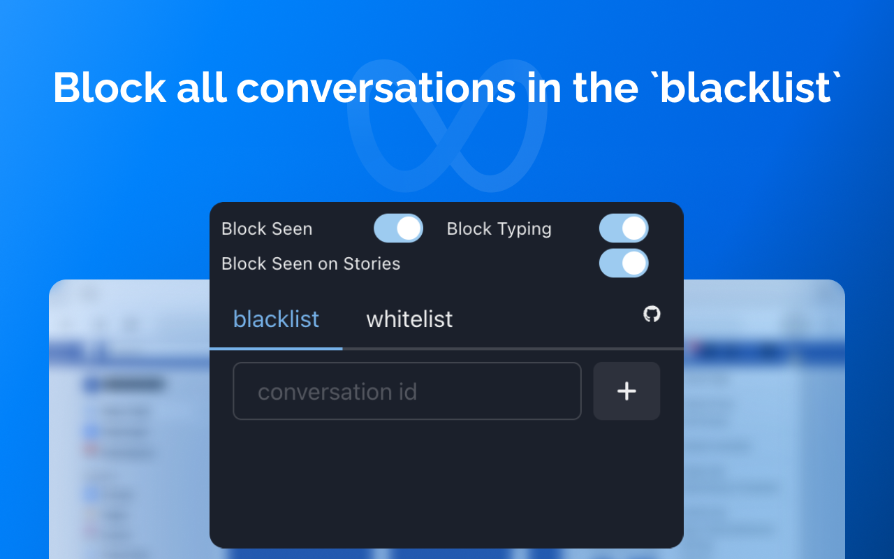

# Tame

Just reverse the name for Meta. :v

## Install

- Get it from Chrome Web Store [here](https://chrome.google.com/webstore/detail/tame/ekkfmgebnjoeklkbnnmkgclphcgemnml)
- Get it from Mozilla Add-ons [here](https://addons.mozilla.org/en-US/firefox/addon/tamev2/)
- For developers, just run:
  ```
  yarn install
  yarn build
  ```

## Screenshots




## Features

- Block seen in chat
- Block typing in chat
- Block seen in stories
- Two blocking modes: `blacklist` and `whitelist`
  - In `blacklist` mode: block all conversations in the `blacklist`
  - In `whitelist` mode: block all conversations not in the `whitelist`
- Working in end-to-end conversations
- Check more detailed usage [here](https://github.com/Sherly1001/tame/wiki/How-to-Use-Tame)
